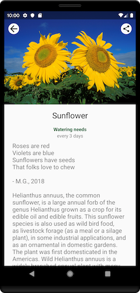
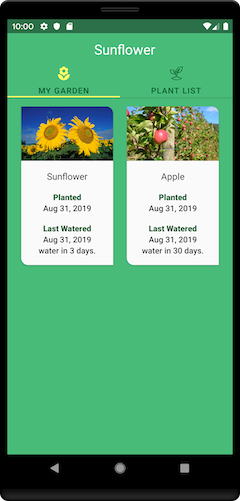

Jardineria
=================

Una aplicación de jardinería que ilustra las mejores prácticas de desarrollo de Android con Android Jetpack.

Jardineria está actualmente bajo un fuerte desarrollo.
Tenga en cuenta que algunos cambios (como las modificaciones del esquema de la base de datos) no son hacia atrás
compatible y puede hacer que la aplicación se bloquee. En este
en su caso, desinstale y vuelva a instalar la aplicación.

Introduction
------------

Android Jetpack es un conjunto de componentes, herramientas y orientación para crear excelentes aplicaciones de Android. Traen
unir la biblioteca de soporte y los componentes de arquitectura existentes y organizarlos en cuatro
Categorías:


Android Sunflower demuestra el uso de estos componentes para crear una aplicación de jardinería simple.

Read the
[Introducing Android Sunflower](https://medium.com/androiddevelopers/introducing-android-sunflower-e421b43fe0c2)
article for a walkthrough of the app.

Getting Started
---------------
Este proyecto utiliza el sistema de compilación de Gradle. Para compilar este proyecto, usa el 
comando 'gradlew build' o usa "Importar proyecto" en Android Studio.

Hay dos tareas de Gradle para probar el proyecto:
* 'connectedAndroidTest' - para ejecutar Espresso en un dispositivo conectado
* 'test' - para ejecutar pruebas unitarias

Para obtener más recursos sobre el aprendizaje del desarrollo de Android, visite el
[Developer Guides](https://developer.android.com/guide/) at
[developer.android.com](https://developer.android.com).

### Unsplash API key

Sunflower uses the [Unsplash API](https://unsplash.com/developers) para cargar imágenes en la galería
pantalla. Para usar la API, deberá obtener una clave de API de desarrollador gratuita. Ver el
[Unsplash API Documentation](https://unsplash.com/documentation) para obtener instrucciones.

Una vez que tenga la clave, agregue esta línea  `gradle.properties` al archivo, ya sea en su página de inicio de usuario (home
directory) (usually `~/.gradle/gradle.properties` on Linux and Mac) or o en la carpeta raíz (root) del proyecto:

```
unsplash_access_key=<your Unsplash access key>
```

La aplicación sigue siendo utilizable sin una clave de API, aunque no podrá navegar a la pantalla de la galería.

Screenshots
-----------





Libraries Used
--------------
* [Foundation][0] - Componentes para las capacidades centrales del sistema, extensiones kotlin y soporte para multidex y pruebas automatizadas.  
  * [AppCompat][1] - Degradar con gracia en versiones anteriores de Android.
  * [Android KTX][2] - Escribe código Kotlin más conciso e idiomático.
  * [Test][4] - Un marco de pruebas de Android para pruebas de interfaz de usuario unitarias y de tiempo de ejecución.
* [Architecture][10] - Una colección de bibliotecas que te ayudan a diseñar aplicaciones robustas, comprobables y mantenibles. Comience con clases para administrar el ciclo de vida de los componentes de la interfaz de usuario y controlar la persistencia de los datos  
  * [Data Binding][11] - Enlazar declarativamente datos observables a elementos de la interfaz de usuario.
  * [Lifecycles][12] - Crear una interfaz de usuario que responda automáticamente a los eventos del ciclo de vida.
  * [LiveData][13] - Crear objetos de datos que notifiquen las vistas cuando cambie la base de datos subyacente.
  * [Navigation][14] - Maneje todo lo necesario para la navegación en la aplicación.
  * [Room][16] - Acceda a la base de datos SQLite de su aplicación con objetos en la aplicación y comprobaciones en tiempo de compilación.
  * [ViewModel][17] - Almacena datos relacionados con la interfaz de usuario que no se destruyan en las rotaciones de aplicaciones. Programe fácilmente tareas asincrónicas para una ejecución óptima.     
  * [WorkManager][18] - Administre sus trabajos en segundo plano de Android.
* [UI][30] - Detalles sobre por qué y cómo usar los componentes de la interfaz de usuario en sus aplicaciones, juntos o separados
  * [Animations & Transitions][31] - Mueva widgets y haga la transición entre pantallas.
  * [Fragment][34] - Una unidad básica de interfaz de usuario componible.
  * [Layout][35] - Crea widgets utilizando diferentes algoritmos.
* Third party and miscellaneous libraries
  * [Glide][90] para la carga de imágenes
  * [Hilt][92]: for [dependency injection][93]
  * [Kotlin Coroutines][91] para administrar subprocesos en segundo plano con código simplificado y reducir la necesidad de devoluciones de llamada

[0]: https://developer.android.com/jetpack/components
[1]: https://developer.android.com/topic/libraries/support-library/packages#v7-appcompat
[2]: https://developer.android.com/kotlin/ktx
[4]: https://developer.android.com/training/testing/
[10]: https://developer.android.com/jetpack/arch/
[11]: https://developer.android.com/topic/libraries/data-binding/
[12]: https://developer.android.com/topic/libraries/architecture/lifecycle
[13]: https://developer.android.com/topic/libraries/architecture/livedata
[14]: https://developer.android.com/topic/libraries/architecture/navigation/
[16]: https://developer.android.com/topic/libraries/architecture/room
[17]: https://developer.android.com/topic/libraries/architecture/viewmodel
[18]: https://developer.android.com/topic/libraries/architecture/workmanager
[30]: https://developer.android.com/guide/topics/ui
[31]: https://developer.android.com/training/animation/
[34]: https://developer.android.com/guide/components/fragments
[35]: https://developer.android.com/guide/topics/ui/declaring-layout
[90]: https://bumptech.github.io/glide/
[91]: https://kotlinlang.org/docs/reference/coroutines-overview.html
[92]: https://developer.android.com/training/dependency-injection/hilt-android
[93]: https://developer.android.com/training/dependency-injection

Upcoming features
-----------------
Las actualizaciones incluirán la incorporación de componentes adicionales de Jetpack y la actualización de los componentes existentes
a medida que evolucionan las bibliotecas de componentes.

Interesado en ver una característica particular del Android Framework o Jetpack implementado en este
¿aplicación? Por favor, abra un nuevo [issue](https://github.com/android/sunflower/issues).

Android Studio IDE setup
------------------------
Para el desarrollo, se requiere la última versión de Android Studio. La última versión puede ser
descargada de [here](https://developer.android.com/studio/).

Sunflower uses [ktlint](https://ktlint.github.io/) to enforce Kotlin coding styles.
Here's how to configure it for use with Android Studio (instructions adapted
from the ktlint [README](https://github.com/shyiko/ktlint/blob/master/README.md)):

- Close Android Studio if it's open

- Download ktlint using these [installation instructions](https://github.com/pinterest/ktlint/blob/master/README.md#installation)

- Apply ktlint settings to Android Studio using these [instructions](https://github.com/pinterest/ktlint/blob/master/README.md#-with-intellij-idea)

- Start Android Studio

Additional resources
--------------------
Echa un vistazo a estas páginas Wiki para obtener más información sobre Android Sunflower:

- [Notable Community Contributions](https://github.com/android/sunflower/wiki/Notable-Community-Contributions)

- [Publications](https://github.com/android/sunflower/wiki/Sunflower-Publications)

Non-Goals
---------
El enfoque de este proyecto está en Android Jetpack y el marco de Android.
Por lo tanto, no hay planes inmediatos para implementar características fuera de este alcance.

Support
-------

- Stack Overflow:
  - https://stackoverflow.com/questions/tagged/android
  - https://stackoverflow.com/questions/tagged/android-jetpack

If you've found an error in this sample, please file an issue:
https://github.com/android/sunflower/issues

Se recomiendan los parches y se pueden enviar bifurcando este proyecto y enviando una solicitud de extracción.
a través de GitHub.

Third Party Content
-------------------
El texto seleccionado utilizado para describir las plantas (en 'plants.json') se utiliza de Wikipedia a través de CC BY-SA 3.0 US (licencia en 'ASSETS_LICENSE').

"[seed](https://thenounproject.com/search/?q=seed&i=1585971)" by [Aisyah](https://thenounproject.com/aisyahalmasyira/) is licensed under [CC BY 3.0](https://creativecommons.org/licenses/by/3.0/us/legalcode)

License
-------

Derechos de autor 2021 Google, Inc.

Licenciado a Apache Software Foundation (ASF) bajo uno o más acuerdos de licencia de colaborador. Consulte el archivo NOTICE distribuido con este trabajo para obtener información adicional sobre la propiedad de los derechos de autor. La ASF le otorga la licencia de este archivo bajo la Licencia Apache, Versión 2.0 (la "Licencia"); no puede utilizar este archivo excepto de conformidad con la Licencia. Puede obtener una copia de la Licencia en

  https://www.apache.org/licenses/LICENSE-2.0

A menos que lo exija la ley aplicable o se acuerde por escrito, el software
distribuido bajo la Licencia se distribuye "TAL CUAL", SIN
GARANTÍAS O CONDICIONES DE CUALQUIER TIPO, ya sean expresas o implícitas.  Ver el
Licencia para el idioma específico que rige los permisos y limitaciones en
la Licencia.
